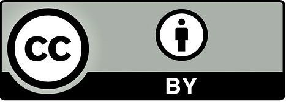

# Práctica 4: Cálculo de la distancia de edición



Copyright [2022] (Daniel Fernández López copyright) Licensed under the Apache License, Version 2.0 (the "License"); 
you may not use this file except in compliance with the License. You may obtain a copy of the License at:
```
http://www.apache.org/licenses/LICENSE-2.0
```
Unless required by applicable law or agreed to in writing, software distributed under the License is distributed on an
"AS IS" BASIS, WITHOUT WARRANTIES OR CONDITIONS OF ANY KIND, either express or implied. See the License for the specific
language governing permissions and limitations under the License.


## Descripción

Implemente en Java la distancia de edición entre dos palabras según lo expuesto
las diapositivas de Dan Jurafsky: 
```
https://web.stanford.edu/class/cs124/lec/med.pdf.
```
No es necesario que almacene la traza para transformar una palabra en
otra. 
